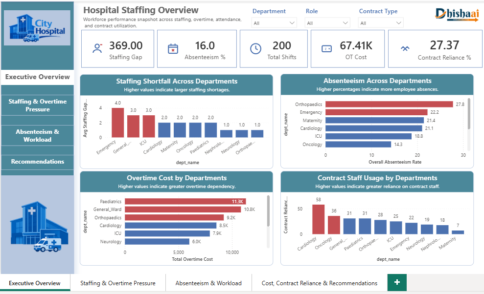
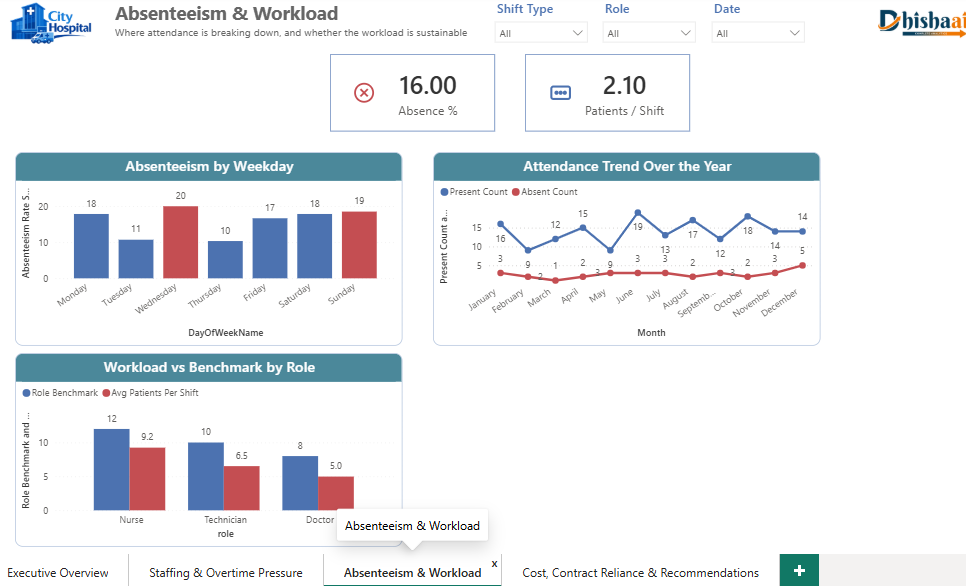
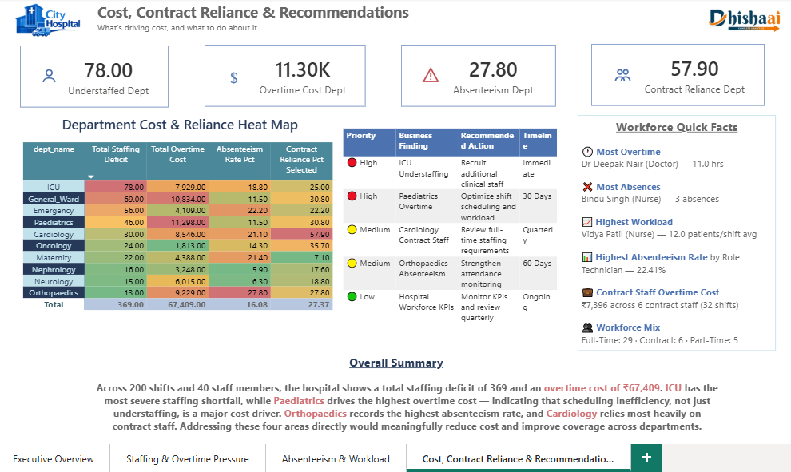

# 🏥 Healthcare Staff Productivity & Shift Analysis

### End-to-End Healthcare Workforce Analytics using Python, MySQL & Power BI

> An end-to-end healthcare workforce analytics project analyzing staffing gaps, shift productivity, overtime, absenteeism, workload, and contract-staff dependency to identify workforce pressure points and support data-driven staffing decisions.

---

## 📊 Dashboard Preview

### Executive Overview



### Staffing & Overtime Pressure


### Absenteeism & Workload



### Cost, Contract Reliance & Recommendations



---

## 🔗 Project Links

| Resource | Link |
|---|---|
| 📂 GitHub Repository | [Healthcare Staff Productivity & Shift Analysis](https://github.com/tanu-94/Healthcare-Staff-Productivity-Shift-Analysis) |
| 🐍 Python Analysis | [Jupyter Notebook](./Python%20Jupyter%20Notebook/) |
| 🗄️ MySQL Analysis | [SQL Files](./MySQL%20Workbench/) |
| 📊 Power BI Dashboard | [Power BI Files](./Power%20BI%20file/) |
| 📸 Dashboard Screenshots | [View Images](./Images/) |

---

# 🎯 Business Problem

Healthcare organizations need to maintain adequate staffing levels while managing overtime, absenteeism, workload, and staffing costs.

Poor workforce allocation can result in:

- Staff shortages during critical shifts
- Excessive overtime
- Increased workload
- Higher absenteeism
- Greater dependency on contract staff
- Increased staffing costs
- Uneven workforce productivity

This project analyzes healthcare staff and shift-level data to identify workforce pressure points and translate the findings into actionable recommendations.

---

# 🎯 Project Objective

The primary objective is to develop an end-to-end analytics solution that answers:

> **Where are staffing pressures occurring, what patterns are associated with them, and what actions could improve workforce planning?**

The project follows the complete analytics workflow:

```text
Raw Data
    ↓
Python
    ↓
Data Cleaning & EDA
    ↓
MySQL
    ↓
SQL Analysis
    ↓
Power BI
    ↓
Data Modeling & DAX
    ↓
Interactive Dashboard
    ↓
Business Insights
    ↓
Recommendations
